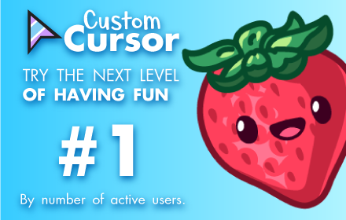

 # Custom Cursor for Chrome™
 

## Fun Custom Cursors for Chrome™

Use a large collection of free cursors or upload your own to completely transform your browsing experience!

Customize your Chrome browser experience with our free collection of mouse cursors at **Custom Cursor**. We’ve created a giant collection of hand-drawn, cute cursors with **over 8,000 different packs** available on our website. Thanks to our amazing community, our collection has grown so big that we’ve divided it into categories to suit every taste, including:

- **Minecraft**
- **Cute Cursors**
- **Anime Mouse Packs**
- **Memes**
- **Spy x Family Pointer Packs with Anya Forger**
- **Among Us**
- **Minimal Pointers** (two types for work and studies)
- **Games**
- **Roblox**
- **And many, many other fun options!**

Some of our mouse pointer packs are bundled directly with the Custom Cursor browser extension, while most await you on our website. Keep an eye out for new and trending additions!

To simplify navigation, we've organized our collection into Editor's Picks collections, each with a unique theme. Examples include:

- **Green Arrows for Autumn**
- **Christmas Themed Arrows**
- **Holidays Editor's Picks**
- **Halloween**
- **Custom Cursor Collaboration with Daieny Schuttz**
- **Pink Pointers Editor Picks**
- **Summer Mouse Decorations**
- **Rainbow Colors**

…and much, much more on our website.

If you can't find what you're looking for, use the **UPLOAD CURSOR** button to add your own. Manage your personal arrow collection on the Upload page and adjust cursor size in the **Manage** section.

Newly added collections will be uploaded to the Custom Cursor for Chrome extension and can be found at the bottom of the collection list. Your added packs will appear in **My Collection**.

Create your own collection of mouse cursors from any images using our Custom Cursor Creator tool on the website. It allows you to craft new packs from almost any arrow- or pointer-shaped image found online.

---

## Installation

To install the Custom Cursor for Chrome extension, simply click one of the buttons below:

> **Note:** Replace `YOUR_EXTENSION_ID` with the actual ID of your extension from the Chrome Web Store.

---

## Usage

1. **Launch the Extension:**  
   After installation, click the Custom Cursor icon in your Chrome toolbar to open the extension interface.

2. **Browse Cursors:**  
   Explore our vast collection of free cursors, neatly organized into various themes and Editor's Picks.

3. **Upload Your Own:**  
   Can't find your perfect cursor? Click the **UPLOAD CURSOR** button to add your custom design.  
   Manage your collection and adjust cursor sizes on the **Manage** page.

4. **Stay Updated:**  
   New collections are regularly added to the extension—check out the bottom of the list for the latest additions and see your personal packs in **My Collection**.

5. **Create Cursors:**  
   Use our Custom Cursor Creator tool on our website to convert any arrow or pointer-shaped image into a unique cursor pack.
